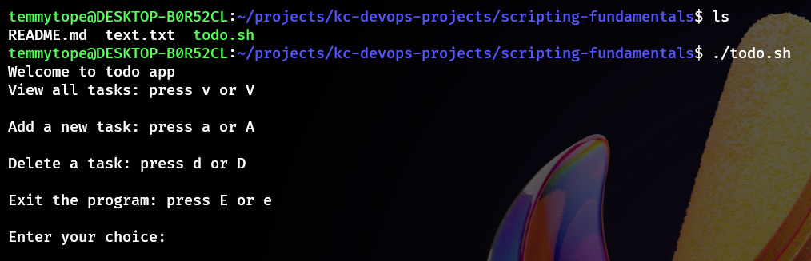
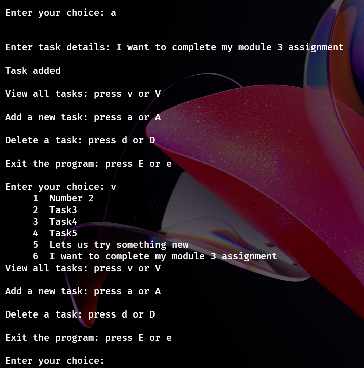

# Shell Scripting Task

## Objective

The aims of the task is to write a simple script that:

1. Display a menu with the following options:
   View all tasks
   Add a new task
   Delete a task
   Exit the program
2. Store tasks in a file named `todo.txt` in the user’s home directory (`~/todo.txt`)
3. Use numbered lines so tasks can be deleted by their number
4. Keep running in a loop until the user chooses to exit

## Usage

1. **Run the scipt**

   ```bash
   ./todo.sh
   ```
2. **Choose an option**

   Follow the on-screen menu to:

   

   Enter your choice

   
3. **Looped Execution**
   The script will keep showing the menu after every operation until you choose to exit.

## Note

Make sure the script is executable:

```bash
sudo chmod u+x ./todo.sh
```
